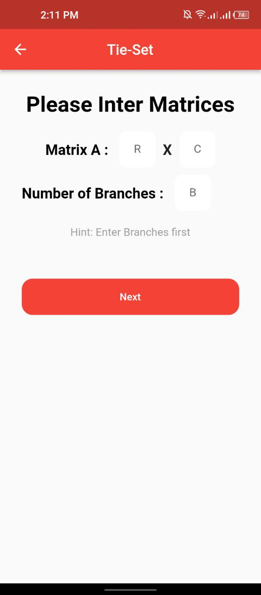
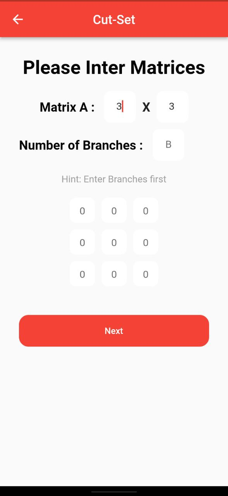
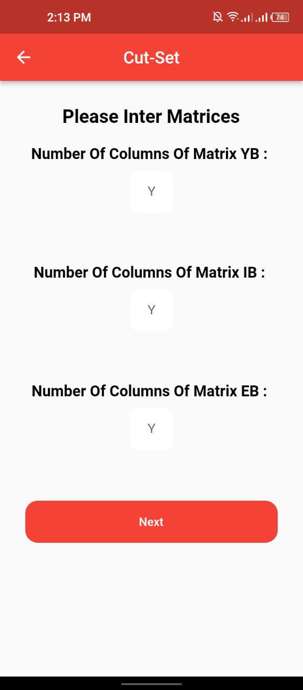

# cad_project

A Computer Aided Design Course project.(mathematical project) Mobile Application works on matrices, where we enter an array and choose the type of operation either cutset or Tieset and the o/p is the Voltage or current on Branches.

## Getting Started
## 🟠Project Screens
  |  |  

